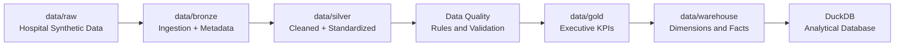

# Lakehouse Pipeline

```mermaid
flowchart LR
    A[data/raw<br>Hospital Synthetic Data] --> B[data/bronze<br>Ingestion + Metadata]
    B --> C[data/silver<br>Cleaned + Standardized]
    C --> D[Data Quality<br>Rules and Validation]
    D --> E[data/gold<br>Executive KPIs]
    E --> F[data/warehouse<br>Dimensions and Facts]
    F --> G[DuckDB<br>Analytical Database]
```