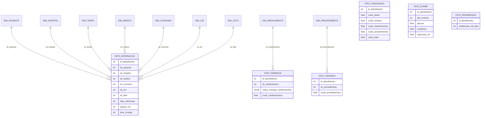

# Enterprise Star Schema

```mermaid
erDiagram
    DIM_PACIENTE ||--o{ FATO_INTERNACAO : sk_paciente
    DIM_HOSPITAL ||--o{ FATO_INTERNACAO : sk_hospital
    DIM_TEMPO ||--o{ FATO_INTERNACAO : sk_tempo
    DIM_MEDICO ||--o{ FATO_INTERNACAO : sk_medico
    DIM_CONVENIO ||--o{ FATO_INTERNACAO : sk_convenio
    DIM_CID ||--o{ FATO_INTERNACAO : sk_cid
    DIM_MEDICAMENTO ||--o{ FATO_FARMACIA : sk_medicamento
    DIM_PROCEDIMENTO ||--o{ FATO_CIRURGIA : sk_procedimento
    DIM_LEITO ||--o{ FATO_INTERNACAO : sk_leito

    FATO_INTERNACAO {
        int id_atendimento
        int sk_paciente
        int sk_hospital
        int sk_medico
        int sk_convenio
        int sk_cid
        int sk_leito
        int dias_internacao
        int passou_uti
        int teve_cirurgia
    }

    FATO_FINANCEIRO {
        int id_atendimento
        float custo_diaria
        float custo_exames
        float custo_medicamentos
        float custo_procedimentos
        float custo_total
    }

    FATO_EXAME {
        int id_atendimento
        int qtd_exames
        float glicose
        float creatinina
        float saturacao_o2
    }

    FATO_CIRURGIA {
        int id_atendimento
        int sk_procedimento
        float custo_procedimentos
    }

    FATO_FARMACIA {
        int id_atendimento
        int sk_medicamento
        string status_estoque_medicamentos
        float custo_medicamentos
    }

    FATO_READMISSAO {
        int id_atendimento
        int readmissao_30_dias
    }
```